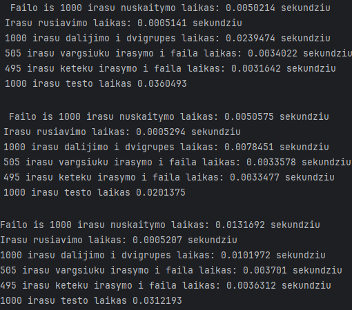
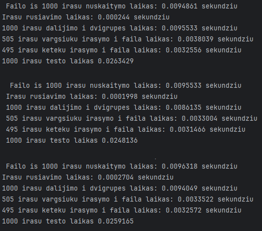
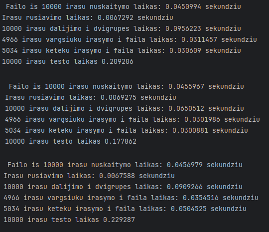
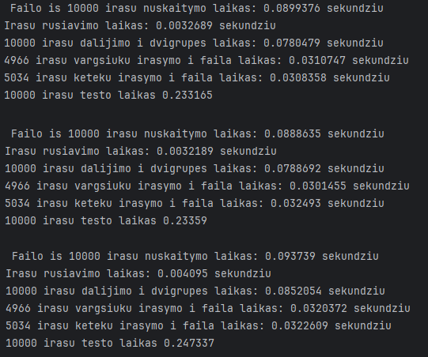
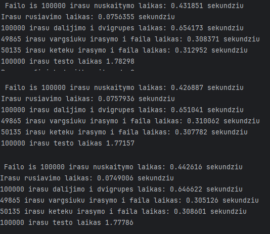
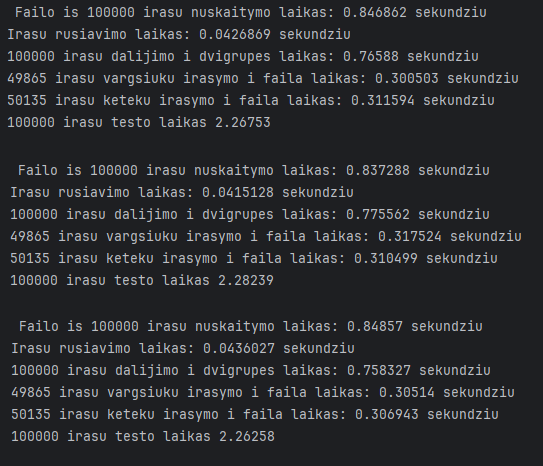
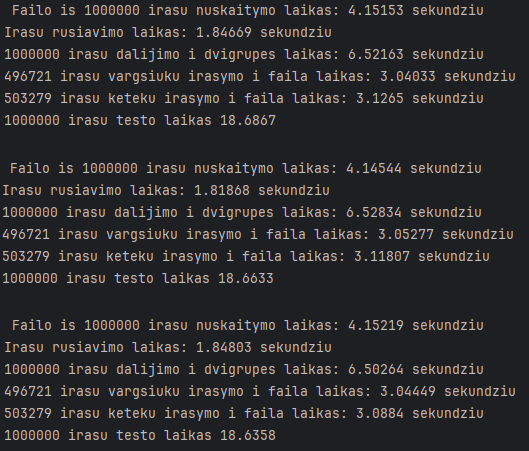
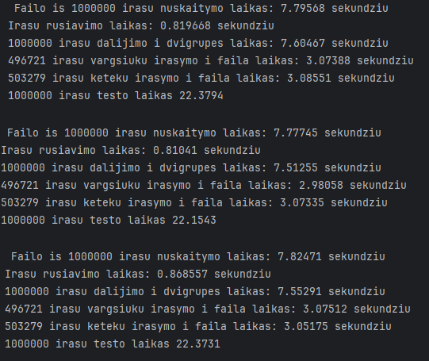
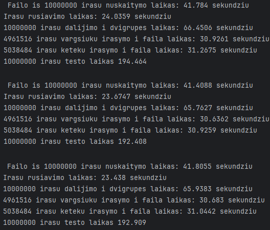
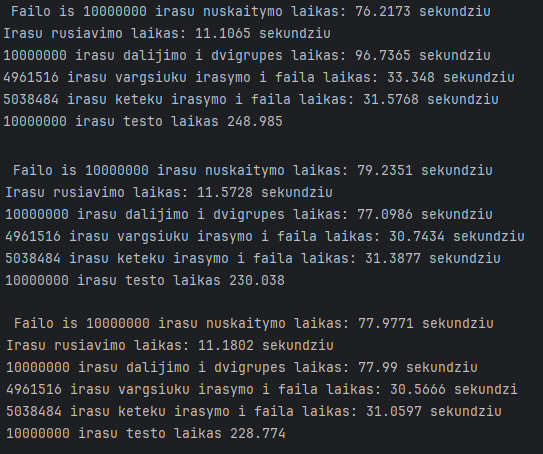

# ___Konteinerių testavimas___
__Testavimo sistemos parametrai__

__CPU:__ AMD Ryzen 7 1700 Eight-Core Processor             3.00 GHz  
__RAM:__ 16 GB 3200 Mhz  
__Storage__: SSD

----------------------------------------------

**Tikslas** - ištirti, ar pasikeistų ir kaip pasikeistų programos sparta, jei vietoje std::vector<Studentai> naudotumėte std::list<Studentai>
  
Kadangi mes žinome, kad tiek ailų kūrimas, tiek ir surūšiuotų rezultatų išvedimas į failus nepriklauso nuo naudojamo konteinerio, demesį atkreipsim į irašų rušiavimo laiką ir __irašų dalijimą į dvi grupes laiką__

Iš pradžių, bus pateikiamį kiekvino failo (nuo 1000 iki 10000000) trys matavimo rezultatai su vektoriu ir su list'u, bus skaiciuojamas trijų matavimo rezultatų vidurkis ir galu gale bus pateikta lentelę su rezultatų (gautų vidurkių) palyginimais

----------------------------------------------

### __std::vector 1000.txt__

### _Skaiciuojame vidurki:_
Irasu rusiavimo laikas:  0,0005243  
1000 irasu dalijimo i dvigrupes laikas:   0,0139966

### __std::list 1000.txt__

### _Skaiciuojame vidurki:_
Irasu rusiavimo laikas:  0,000238067  
1000 irasu dalijimo i dvigrupes laikas:     0,00919057
----------------------------------------------------------------------------------------------------------
### __std::vector 10000.txt__

### _Skaiciuojame vidurki:_
Irasu rusiavimo laikas:  0,00680517  
10000 irasu dalijimo i dvigrupes laikas:  0,0840203 

### __std::list 10000.txt__

### _Skaiciuojame vidurki:_
Irasu rusiavimo laikas:  0,0035276  
10000 irasu dalijimo i dvigrupes laikas:   0,0807075

---------------------------------------------------------------------------------------------------------

### __std::vector 100000.txt__

### _Skaiciuojame vidurki:_
Irasu rusiavimo laikas:  0,0754426  
100000 irasu dalijimo i dvigrupes laikas: 0,650612

### __std::list 100000.txt__

### _Skaiciuojame vidurki:_
Irasu rusiavimo laikas:  0,0426008  
100000 irasu dalijimo i dvigrupes laikas:  0,76659

----------------------------------------------------------------------------------------------------

### __std::vector 1000000.txt__

### _Skaiciuojame vidurki:_
Irasu rusiavimo laikas:  1,8378  
1000000 irasu dalijimo i dvigrupes laikas: 6,51754

### __std::list 1000000.txt__

### _Skaiciuojame vidurki:_
Irasu rusiavimo laikas:  0,832878
1000000 irasu dalijimo i dvigrupes laikas: 7,55671

----------------------------------------------------------------------------------------------------

### __std::vector 10000000.txt__

### _Skaiciuojame vidurki:_
Irasu rusiavimo laikas:  23,71586  
10000000 irasu dalijimo i dvigrupes laikas:66,05053

### __std::list 10000000.txt__

### _Skaiciuojame vidurki:_
Irasu rusiavimo laikas:11,2865   
10000000 irasu dalijimo i dvigrupes laikas: 83,9417

----------------------------------------------------------------------------------------------------

# __Analizė__

| Failai:      | Rusiavimo laikas (Vector) | Rusiavimo laikas (List) |
|:-------------|:-------------------------:|------------------------:|
| 1000.txt     |         0,0005243         |             0,000238067 |
| 10000.txt    |        0,00680517         |               0,0035276 |
| 100000.txt   |         0,0754426         |               0,0426008 |
| 1000000.txt  |          1,8378           |                0,832878 |
| 10000000.txt |         23,71586          |               11,2865   |

| Failai:      | Dalijimo i grupes laikas (Vector) | Dalijimo i grupes laikas (List) |
|:-------------|:---------------------------------:|--------------------------------:|
| 1000.txt     |             0,0139966             |                      0,00919057 |
| 10000.txt    |             0,0840203             |                       0,0807075 |
| 100000.txt   |             0,650612              |                         0,76659 |
| 1000000.txt  |              6,51754              |                         7,55671 |
| 10000000.txt |             66,05053              |                         83,9417 |

Ši analizė leidžia susidaryti išsamų vaizdą apie tai, kaip keičiasi programos našumas, kai naudojame std::vector ir std::list skirtingų dydžių duomenims.  
Naudojant std::list, laikas, reikalingas dalijimui į dvi grupes, dažnai yra panašus arba šiek tiek didesnis nei naudojant std::vector. Tai rodo, kad std::list gali būti mažiau efektyvus.
Naudojant std::list, laikas, kurį reikia rusiuoti įrašus, dažniausiai yra mažesnis nei naudojant std::vector. Tai yra pagrįsta tuo, kad std::list leidžia efektyviau įterpti ir ištrinti elementus, o tai yra būtina operacija rusiuojant duomenis.